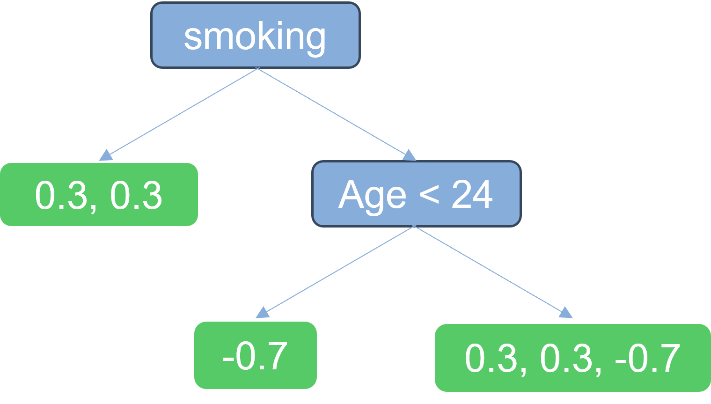
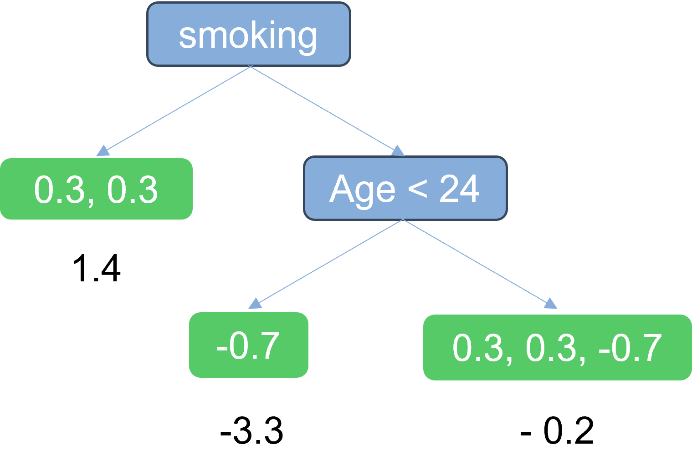
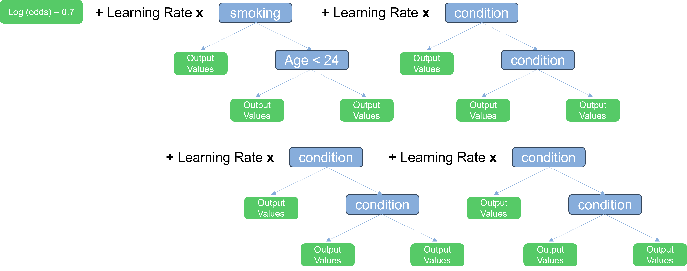
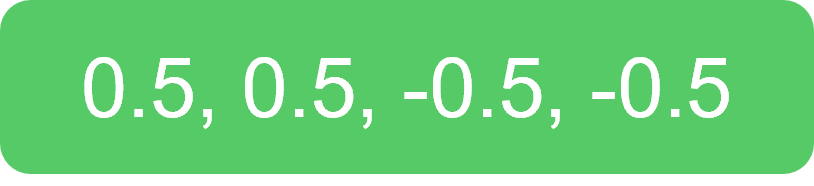
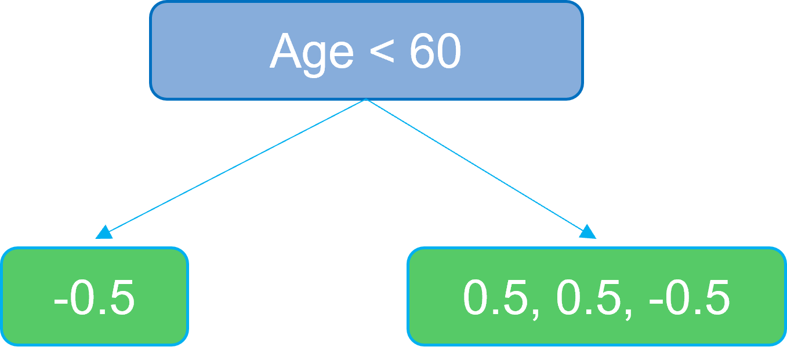
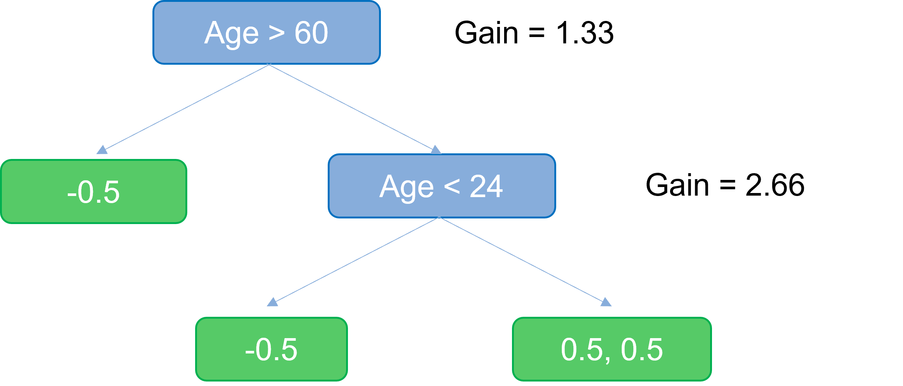
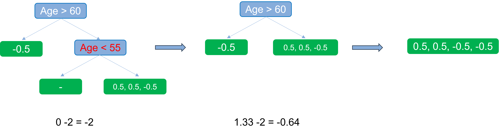
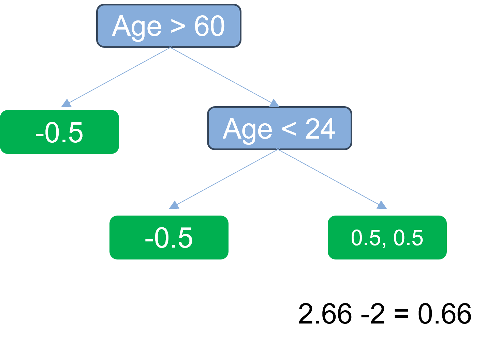
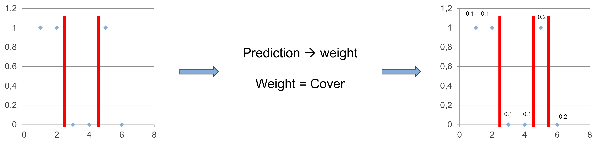
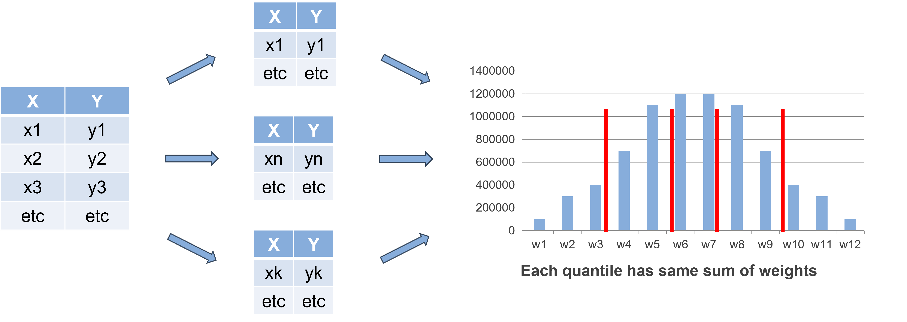

# XGBoost Tutorial

## Gradient Boosting

Gradient Boosting is a powerful ensemble learning technique in machine learning that has gained immense popularity for its ability to produce highly accurate predictive models. It belongs to the family of boosting algorithms, which focus on combining multiple weak learners (typically decision trees) to create a strong learner. Gradient Boosting works by sequentially adding decision trees to the ensemble, with each tree correcting the errors made by the previous ones. In the following part we will focus on the classification model, but there is also an regression model of Gradient Boosting.

The target is to explain how trees are combined and evaluated. This allows us to then step deeper into how the trees are build when we talk about XGBoost.

To explain Gradient Boosting we use this simplified dataset:

| Age | Smokes | **Drinks** |
| :-: | :----: | :--------: |
| 35  |  yes   |  **yes**   |
| 18  |   no   |   **no**   |
| 18  |  yes   |  **yes**   |
| 65  |   no   |  **yes**   |
| 25  |   no   |  **yes**   |
| 44  |   no   |   **no**   |

First we start with creating a single leaf which predicts our outcome. The initial leaf is created by the log(odds). After this we use another formula to make a probability out of the log(odds). Here an example:

$$ log(odds) = \ln{}(\frac{count(yes)}{count(no)}) = \ln{}(\frac{4}{2}) = 0.6931 \approx{0.7}$$

$$ Probability = \frac{e^{\ln{}(\frac{4}{2})}}{1+e^{\ln{}(\frac{4}{2})}} = 0.6667 \approx{0.7}$$

 

  

After we calculated our initial leaf, which is used to get an initial prediction, we calculate Pseudo Residuals based on this initial prediction : $$ Residual = Observed Value - Predicted Value $$

This leads to this Residuals (first row includes formula):

| Age | Smokes | **Drinks** |   Residual    |
| :-: | :----: | :--------: | :-----------: |
| 35  |  yes   |  **yes**   | 1 - 0.7 = 0.3 |
| 18  |   no   |   **no**   |     -0.7      |
| 18  |  yes   |  **yes**   |      0.3      |
| 65  |   no   |  **yes**   |      0.3      |
| 25  |   no   |  **yes**   |      0.3      |
| 44  |   no   |   **no**   |     -0.7      |

In the next step a tree is build to predict the residuals. This is a simplyfied and possible tree:

  

The problem now is that we created the tree based on probabilities. To get later to our log(odds) we have to apply a transformation function to get correct output values. We apply it for the first leaf as example:

$$ \frac{\sum Residual_i}{\sum [PreviousProbability_i \cdot (1-PreviousProbability_i)]} $$

$$ OutputValueFirstLeaf = \frac{\sum -0.7}{\sum [0.7 \cdot (1-0.7)]} = -3.3 $$

As Result we get this tree with these calculated output values:

  

To calculate our new log(odds) we scale our output values with a learning rate and add it to our previous log(odds). The learning rate controls the step size at which the model adjusts to errors. A smaller learning rate makes the learning process slower but often leads to better accuracy, while a larger learning rate makes it faster but may risk overfitting. It's a crucial hyperparameter that balances learning speed and model performance. It is also easier to for the algorithm to react to errors by using a lower learning rate. The formula is:

$$ log(odds) Prediction = previousLog(odds) + learningRate \cdot output values $$

Here is an example how the new probabilities are calculated:

$$ log(odds) Prediction = 0.7 + 0.1 \cdot -3.3 = 0.37 $$

$$ Probability = \frac{e^{0.37}}{1+e^{0.37}} = 0.59 $$

Here is a new table with the new probabilities, which lead as well to new residuals:

| Age | Smokes | **Drinks** | Probabilities | Residual | Last Residual |
| :-: | :----: | :--------: | :-----------: | :------: | :-----------: |
| 35  |  yes   |  **yes**   |     0.84      |   0.16   |      0.3      |
| 18  |   no   |   **no**   |     0.59      |  - 0.59  |     -0.7      |
| 18  |  yes   |  **yes**   |     0.84      |   0.16   |      0.3      |
| 65  |   no   |  **yes**   |     0.68      |   0.32   |      0.3      |
| 25  |   no   |  **yes**   |     0.68      |   0.32   |      0.3      |
| 44  |   no   |   **no**   |     0.68      |  -0.68   |     -0.7      |

Based on the new residuals new trees will be created until a specific number of trees (n_estimators) is reached. The goals is again to predict the residuals and based on this also improving the residuals from tree to tree.

Do not forget that this little Dataset is only an example and very hard to fit because of the low amount of Data.

  

The final probabilities of new data is calucalated with this formula:

$$ log(odds) Prediction = \ln(odds)_0 + \sum_{i=1}^{n\_{estimators}} learingRate \cdot OutputValue_i $$

$$ Probability = \frac{e^{log(odds) Prediction}}{1+e^{log(odds) Prediction}} $$

## XGBoost

XGBoost is correctly called Extreme Gradient Boosting. This name includes that XGBoost is based on Gradient Boosting. The **extreme** improvement is made in the way how XGBoost builds the trees. XGBoost still uses the residuals to create a new tree and it also combines mutltiple unique trees scaled by a learning rate like Gradient Boosting. The Learning rate in XGBoost is called $\eta$ (eta).

To explain how XGBoost is build we use this simplyfied dateset:

| Age | **Drinks** | Initial Prediction |
| :-: | :--------: | :----------------: |
| 35  |  **yes**   |        0.5         |
| 24  |  **yes**   |        0.5         |
| 18  |   **no**   |        0.5         |
| 65  |   **no**   |        0.5         |

If we want to build a tree we first start with a single leaf which contains all residuals. The initial residuals are calculated in the same way as in Gradient Boosting, leading to the formation of the first leaf of the tree.

  

After creating new leafs we always calculate the Similarity Score for the leafs and the Gain based on the leafs' Similarity Score.

$$ Similarity Score = \frac{(\sum Residual_i)²}{\sum [PreviousProbability_i(1-PreviousProbability_i)] + \lambda } $$

 

The Similarity Score for our leaf is 0 because $(\sum Residual_i)²$ is 0. Special for XGBoost is the $\lambda$ parameter. This is a regularization parameter which reduces the sensitivity to isolated observations. Based on the Similarity Score usually the Gain is calculated with this formula:

$$ Gain = Left\cdot{Similarity} + Right\cdot{Similarity} - Root\_{Similarity} $$

As you can see, it is only possible to calculate the Gain for nodes. With the Gain it is possible to evaluate the effectiveness of the selected node condition. For instance let's set a root node condition.

  

Now we can calculate the Similarity Score for the leafs and then the Gain of our root node. In our case, to simplify, we set $\lambda$ to 0 :

$$ Similarity Score\cdot{right} = \frac{(0.5+0.5-0.5)²}{0.5(1 - 0.5) + 0.5 _ (1 - 0.5) + 0.5(1 - 0.5) + 0 } = 0.33$$
$$ Similarity Score_{left} = \frac{(-0.5)²}{0.5(1 - 0.5) + 0} = 1$$

Based on this we can calculate the Gain (the higher the better):

$$ Gain = 1 + 0.33 - 0 = 1.33$$

In our example we can easily see that our condition for the root node is the most fitting one. Usually XGBoost trys every option as node condition or uses the Greedy Algorithm which we will discuss later. For our example we assume that we directly have the best option. As result the next node would lead to this tree:

  

The Gain of the new node would be this:

$$ Gain = 1 + 2 - 0.33 = 2.66$$

To avoid overfitting XGBoost uses a score called Cover. If the Cover score for a leaf is lower than 1 (default value) XGBoost doesn't allow those leafs. This has the effect that it can't be to precise and XGBoost has to find better node conditions to classify more values with one node. The Cover is calculated with this formula:

$$ Cover = \sum [PreviousProbability_i(1-PreviousProbability_i)] $$

$$ Cover\_{BottomLeftLeaf} = \sum 0.5(1-0.5) = 0.25$$

In our case the cover is always to low because the example dataset is to small. In regards to the small dataset we allow all Covers which are greater than 0.

Another parameter to avoid overfitting is gamma. $\gamma$ is used to make sure that the Gain of our nodes is high enough so that we get a minimum of information out of the conditions. If Gain - $\gamma$ is lower than 0 the algorithm prunes the node. For pruning XGBoost always starts in the lowest leafs. XGBoost continious pruning until the Gain is high enough. Let's assume $\gamma$ = 2 and we change the threshold of the second node :

  

 
In this case we first get the Gain 0 because the new threshold of the red colored node isn't able to devide it better than before. As result we get a negative values till we pruned the tree to the intial leaf. Nevertheless, let' switch back to our good result, which we don't have to prune.

  

Don't forget $\lambda$ has also an impact to this pruning because it reduces the Gain of leafs with few predicted residuals.

If we want to calculate the output values of the tree. It is equal to Gradient Boosting. We only add $\lambda$:

$$ \frac{\sum Residual_i}{\sum [PreviousProbability_i(1-PreviousProbability_i)] + \lambda} $$

To obtain new predictions and compute residuals for the next unique tree, we follow the same process as in the Gradient Boosting phase.

At least one thing is unclear, because searching for every possible threshold for our nodes is very time consuming. To be faster we use the Approximate Greedy Algorithm. This algorithm splits our data into a specific amount of quantiles. After splitting those quantile boardes are used to evaluate the threshold for the nodes. To split the quantiles more effective we calculate a weight for each values. For this our cover formula is used. Then we try to split the data into quantiles which all contains the same sum of weights like in this picture:

  

To be even more effecient we can split the data to our threads. Then each thread can calculate the sum of weights for their split. At least the result can be easily merged into an histogramm which can be used to set the quantiles.

  

In summary, XGBoost enhances the Gradient Boosting algorithm with efficient tree construction, regularization, pruning, and optimization techniques, making it a popular choice for various machine learning tasks.

Source: [StatQuest YouTube Channel](https://www.youtube.com/@statquest)
